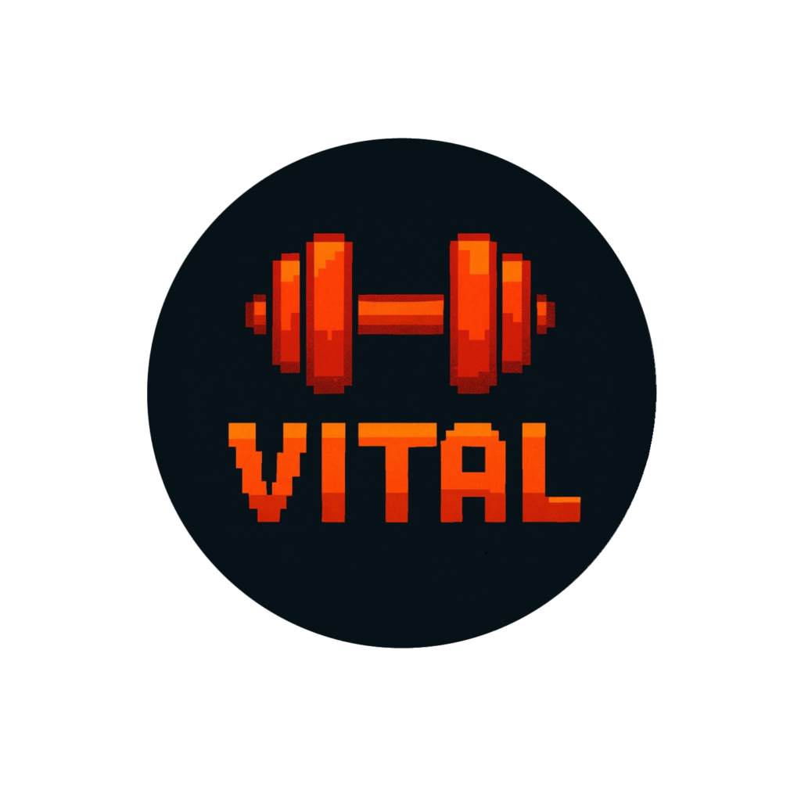

# 🏋️ Vital - Seu treino, sua evolução

<p align="center">
  
</p>

O Vital é um app de treino gamificado que transforma sua rotina fitness em uma jornada divertida.
Ganhe níveis, moedas, avatares e temas enquanto acompanha seus treinos, atividades e evolução.
Na versão Pro, dispute também no ranking global!

## 🎮 Funcionalidades

- 📊 Criação e controle de treinos e atividades

- ⚡ Sistema de level, moedas, avatares e temas

- 🥇 Ranking competitivo (na versão paga)

- 🧮 Cálculo de IMC

- 💧 Monitoramento de consumo de água

- 😴 Controle das horas de sono

## 🛠️ Tecnologias

- Flutter / Dart

- SQLite para armazenamento local

- Firebase para serviços em nuvem

- SharedPreferences para configurações rápidas

```bash
  # Clone o repositório
git clone https://github.com/malvesbruno/Vital.git

# Entre na pasta
cd vital

# Instale as dependências
flutter pub get

# Rode o projeto
flutter run
```

## 📌 Roadmap (Missões futuras)
[ ] adicionar notificações

## 📜 Licença
- Este projeto está licenciado sob a MIT License - veja o arquivo LICENSE
 para mais detalhes.
